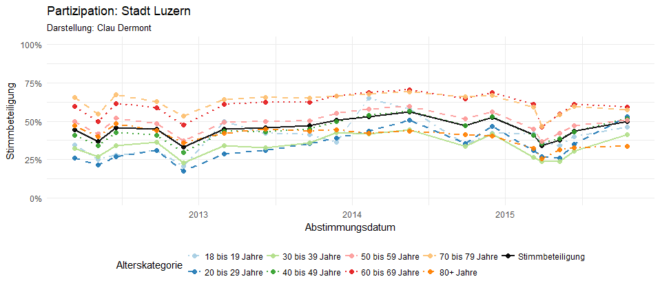
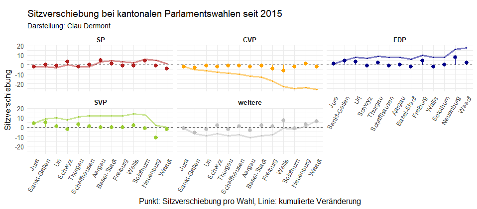

# rshinycd

This repository contains Shinyapps deployed to shinyapps.io

If you want to recreate the apps, use the following code:

## turnoutr
Turnout in the city of Lucerne and the canton of Neuchâtel for age-gender groups. 
Official aggregated data, collected from the institutions' website. 

Shinyapps: https://cdermont.shinyapps.io/turnoutr/



```R
library(shiny)
library(ggplot2)
library(plotly)

runGitHub("rshinycd", "cdermont", subdir = "turnoutr/")
```

## Parteitrends
Strenght of parties in cantonal parliaments, both since the last federal election (Oct. 2015) and since the data is recorded by the Office of Statistics. 

Shinyapps: https://cdermont.shinyapps.io/parteitrends/



```R
library(shiny)
library(ggplot2)
library(dplyr)
library(tidyr)

runGitHub("rshinycd", "cdermont", subdir = "parteitrends/")
```
